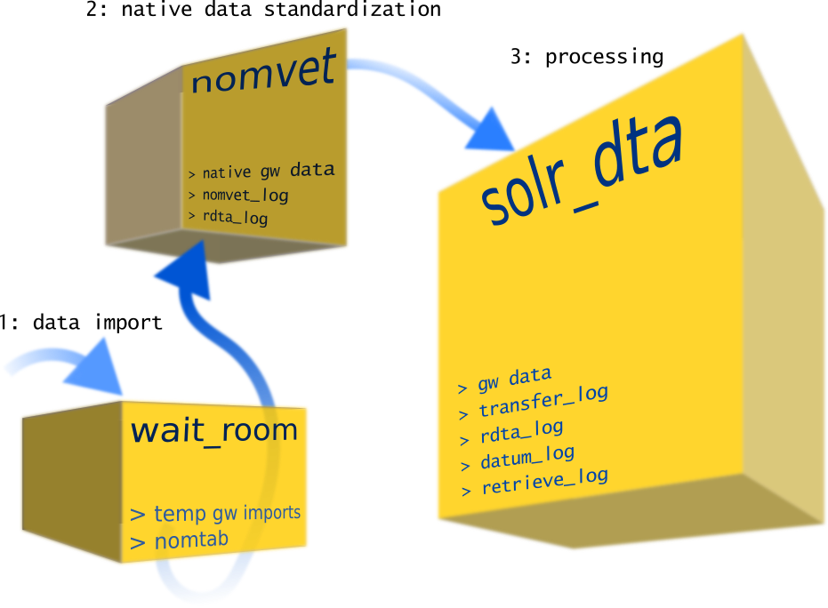
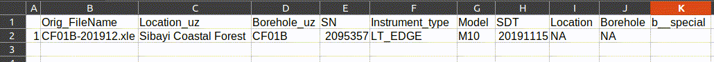
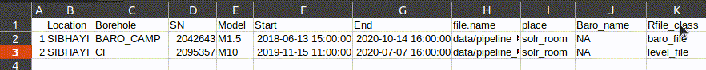

```{r setup, echo=FALSE, results="hide"}
defaultW <- getOption("warn") 
options(warn = -1)
knitr::opts_knit$set(root.dir = "/home/paulg/Documents/projects_current/ipayipi_data_pipe")
library(ipayipi)
options(warn = defaultW)
```

```{r check-wd, eval=FALSE, echo=FALSE}
getwd()
```

# Summary

This vignette introduces SAEON's __ipayipi__ bulk data processing pipeline for time series data.


1. Install `R ipayipi` 
2. Initiate pipeline \& automate metadata consolidation in **R** objects (_mobile app template available_)
3. Start batch processing <a id="naartjietime"></a> \.\.\. 

<br/>

4. Built in data visualization with **ggplot** or _interactive_ **dygraphs** (below) <a id="dychart"></a> \.\.\.
```{r vasiviz, echo=FALSE}
gw <- readRDS("data/VASI_A1.rds")
library(dygraphs)
gw_vis_dy(gw, vis_type = 3, dippr = TRUE, show_events = TRUE)
```
# Introduction

Organising time series data from remote servers or from logger download requires a large amount of sorting, checking, and just general organisation. iPayipi provides some tools for automating and speeding up this process. Importantly, the iPayipi pipeline preserves the integrity of your raw data so that when the time comes, the raw data is available in a standardised format, and the processing of this data can be updated. Everything in the pipeline is designed to make any processing of raw data traceable. In the process iPayipi harvests all the appropriate metadata required for dataset publication.

# Initiating the pipeline

1. **wait_room** directory where is data imported then imbibed and standardised.
2. **nomvet_room** for storing standardised data. 
3. ***ipip_room*** folder where station data is processed.

<br/>

<br/>

The `ipip_init()` function will create these directories in a specified working directory (`work_dir`) --- old directories and their contents will not be overwritten/deleted.

```{r pipe setup}
pipe_dir  <- "data/pipeline_generic" # pipe directory

pipe_init(work_dir = pipe_dir)

# check that the folders have been created
list.dirs(pipe_dir)
```

<br/>

# Importing data

iPayipi imports text delimited files from a specified directory. Either a commandline prompt can be used to filter files for importing, or search keywords can be specified.

Import your data from a directory using `logger_data_import_batch()`.

```{r data import}
# directory where data is imported too ...
wait_room <- file.path(work_dir, "wait_room")

# directory where data is imported from
source_dir <- file.path("pipe_data_rainfall/rain_generic/csv_in")

# import data
logger_data_import_batch(source_dir = source_dir, wait_room = wait_room,
    file_ext = ".csv", # here we are looking for 'csv' files
    recurr = TRUE # and looking for these recursively, i.e., into subdirectories
    )

# check that the files have been imported...if you want
list.files(wait_room)
```

We could have used the `wanted` or `unwanted` arguments for filtering `csv' files for import, but here this was not necessary.

But first, a note on the format of data headers.

You can customize harvesting of metadata from a text delimited file. Generally, storing of header metadata is in the rows preceding data column headers. This is all specified in your data setup.

So take the example of a Hobo rainfall `csv' file as seen below.

This does not have its header metadata stored 'above' it's column headers, but it does have some valuable information that should be extracted from the column headers, specifically, serial numbers. The data setup shown below is described, but checkout the function documentation `?imbibe_raw_logger_dt()` for more information.

```{r data setup}
hobo_string_extract_logger_sn <- list(
    rng_pattern = "LGR.S.N..",
    rel_start = 9,
    rel_end = 16
)
hobo_data_setup <- list(
    file_format = "hobo_csv_export",
    station_title = rici(ri = 1, ci = 1),
    location = "cp",
    logger_type = "hobo_pendant",
    logger_sn = rng_rici(r_fx = 2, c_fx_start = 3,
        c_fx_end = "extract", setup_name = "logger_sn",
        string_extract = hobo_string_extract_logger_sn),
    table_name = "hobo_data",
    date_time = 2,
    phen_name = rng_rici(r_fx = 2, c_fx_start = 3,
        c_fx_end = "extract", setup_name = "phen_name"),
    data_row = 3, id_col = 1)
```

Notice how some data setup fields are provided in the list, and others have conditions specified for extraction.
 - `file_format` is provided.
 - `station_title` a row and column index specified.
 - `location` the broader location code name for the area is provided here.
 - `logger_type` had to be provided as this was not present in the file header.
 - `logger_sn` instead of a single row and column index for an individual cell `rng_rici()`, is used to define a range of cells in row two (specified by `r_fx`), starting at column 3 (specified by `c_fx_start`), ending in the last data column (specified with `extract', i.e., the function will extract the column range up to the last extracted file column with data).
 Within this range the `hobo_string_extract_logger_sn` object provides guidelines for extracting the serial number from the row and column where it is found. Searching in the column headers is done via the `rng_pattern` argument. The first occurrence of a matching pattern has its characters extracted, starting from the character position relative to the search pattern `rel_start` and ending at `rel_end`.
 - `table_name` for hobo files this has to be specified. The TA01 files sometimes use the time interval between recordings (temporal frequency of recording) as a table name, therefore, multiple table names can be specified per station.
 - `date_time` the column with date-time stamps.
 - `phen_name` the header row (`phen' is short for phenomena (or variable)).
 - `data_row` the row in which data values start (does not include the header row).
 - `id_col` the column with record IDs.

Once your `data setup' has been specified for a particular logger or instrument save it for future use!

`imbibe_raw_batch()`, which begins the process aligning data standards and reading the logger data, uses the `data_setup` list defined above. This function works its way through files in the waiting room checking file metadata and examines date-time stamps (_see also_ `ipayipi::record_interval_eval()` documentation).

```{r imbibe data}
imbibe_raw_batch(
    wait_room = wait_room, # everything stays in this directory, for now ...
    file_ext_in = ".csv", # file extension
    col_dlm = ",", # the delimeter of the file
    data_setup = hobo_data_setup, # defined above
    record_interval_type = "event_based" # record intervals are not continuous here
)
```

The time-zone can be set using the `dt_tz` argument---the default is `Africa/Johannesburg'.

# Standardising data

The standardisation of phenomena (variable) metadata and other harvested metadata are separate processes; phenomena standardisation must be dealt with last.

```{r noms1}
nomenclature_sts(wait_room = wait_room) # checks header information
```

If `nomenclature_sts()` detects new or undescribed standards a nomenclature table (comma-separated format), with prefix `nomtab', is written to the 'waiting room'---otherwise the function will standardise all data files in the 'waiting room'. The location and station must standardised---these strings should be concatenated around an underscore to makeup the stations standardised title. This all enhances the integrity of the pipeline.


1. `gw_xle_import()` — brings new data into the pipeline
2. `gw_xle_nomenclature()` — checks naming and file metadata
3. `gw_xle_rename()` — 

<br/>

## 1. `gw_xle_import()`
Only [Solonist](www.solinst.com/) data ('.xle') files are processed within ipayipi at this stage. To import Solonist data files use the `gw_xle_import()` function. Note that the encoding of the file will be standardized to UTF8 & the way in which units are reported upon import. Raw data is only copied (not cut) so your original data will be unaffected.

```{r data import}
xle_import(
    input_dir = "data/", # raw data directory
    wait_room = "data/pipeline_gw/wait_room/", # 'wait_room' directory
    recurr = FALSE # not searching recursively in the 'input_dir'
    )
```

Note that the data has been renamed according to the date range of respective files.

<br/>

## 2. `gw_xle_nomenclature()`
In any pipeline it is important to vet file names and metadata. Without vetting different data streams may erroneously get appended and processed together. To standardize and check how data files are named and their metadata is stored (including spelled) a this function must be run next in the pipeline.

```{r nomvet check}
gw_xle_nomenclature(
    wait_room = "data/pipeline_gw/wait_room/", # 'wait_room' directory
    out_csv = TRUE
    )
```
The function checks file names and spelling, that is, file nomenclature against an automatically generated nomenclature table. _If_ there are any _new_ names or sites the function will generate a csv with all unique file names which have entered the data pipeline. Spelling errors and misnamed files entering the pipeline for the first time are tagged. The `out_csv` should always be set to `TRUE` so that when running `gw_xle_nomenclature()` this csv is automatically generated. You can edit the csv file as below to standardize the file names.



The example above demonstrate the type of metadata that is extracted from the raw solonist files (e.g. logger serial number). The **uz** in for example the "Location_uz" column designates the _unstandardized_ site 'Location' of the Solonist logger. The standardized "Location" name was entered in _column I_ of the spreadsheet editor. Only the cells/values marked with R's no data holder __NA__ require editing at this stage.

Once the nomenclature in the **'nomtab_YYYYMMDD-HH:MM.csv'** has been corrected as in the example above --- the updated csv file can be imported using `gw_read_nomtab_csv()` this function will rerun `gw_xle_nomenclature()` to check that naming issues have been resolved.

```{r delete temp_nomtab, echo = FALSE}
fs <- list.files("data/pipeline_gw/wait_room/", pattern = ".csv", recursive = FALSE, full.names = TRUE)
for (i in seq_along(fs)) {
  unlink(fs[i], recursive = FALSE)
}
```

```{r read nomtab}
gw_read_nomtab_csv(
  wait_room = "data/pipeline_gw/wait_room/",
  file = "data/nomtab_example.csv"
)
```

It is important to use `gw_xle_nomenclature()` each time data is fed into the pipeline but, if there are no new sites or variations in spelling thereof, editing the nomenclature table is not necessary. The nomenclature table can also be edited directly in R, however, it is safer to edit the automatically generated csv file as above.

<br/>

## 3. `gw_xle_rename()`
Now that the nomenclature has been vetted the data files in the 'waiting room' are renamed and their internal metadata adjusted to match the pipeline's nomenclature table.

```{r renaming files}
gw_xle_rename(
  wait_room = "data/pipeline_gw/wait_room/",
  out_csv = TRUE
)
```

<br/>

# Archiving standardized native groundwater data

From the 'waiting room' data files that have had their nomenclature and standards vetted are pushed for archiving into **'nomvet room'**. While transferring files a log of which files have moved from the 'waiting room' to the 'nomvet room' is generated and stored in the **'nomvet room'**. This log is useful for future reference, i.e., to check what files are available. In addition, the log is by the pipeline to prevent duplication of archived imports in the 'nomvet room'. I use the vetted native Solonist files archived the 'nomvet room' for sharing with collaborators who prefer using Solonist software for processing their data.

## 1. `gw_xle_transfer()`
`gw_xle_transfer()` is used to copy vetted Solonist files into the 'nomvet room'.

```{r file transfer}
gw_xle_transfer(
  wait_room = "data/pipeline_gw/wait_room/",
  nomvet_room = "data/pipeline_gw/nomvet_room/"
)
```

<br/>

First then function noted that before the transfer there were no Solonist 'xle' files in the **'nomvet room'**. After transferring files the function returns a list of any duplicates that were already in the **'nomvet room'** and therefore not copied across, plus, a list of files transferred and then a printout of the automatically generated '_nomvet_log_'.

# Processing groundwater data in **R**

This is where the fun starts. The data is now ready to be converted from it's native web (xml) format into R. Once in R format the data can be processed into meaningful data. The data processing consists of the following steps: 

1. `gw_site_series()` --- appends data
2. `gw_baro_comp_batch()` --- barometric compensation
3. datum and log retrieve import
4. outlier detection
5. drift correction

## 1. `gw_site_series()` --- append data

Importantly, the standardized names of the files stored in the 'nomvet room' are used as the identifiers for appending Solonist data files. A call of  `gw_site_series()` will append all files in the '_nomvet\_room_' with the same file names and save them as a native R (_rds_) file in the Solonist R data directly or '_solr\_room_'. In the pipeline design, each time data is imported into the 'nomvet room', `gw_site_series()` should be run. It will detect new files and append these to extant data, or if the site is new, it will generate a new native R file in the '_solr\_room_'. Exactly how data appended is determined by `gw_xle_to_R()` and `gw_rdta_append()` --- check their documentation for details and how to use these outside of the pipeline.

```{r siteseries}
gw_site_series(
  solr_room = "data/pipeline_gw/solr_room/", # native R data
  nomvet_room = "data/pipeline_gw/nomvet_room/" # standardized solonist data
)
```

<br/>

The output messages from the function demonstrate the live progression of the function (and are useful for debugging). Two log files are kept in the '_solr\_room_': the '__transfer_log__' keeps a record of which files have been transferred from the `_nomvet\_room_' and is used for checking which files need appending/updating; the '__rdta_log__' contains a catalogue of all data files in the '_solr\_room_' and related metadata which is used further down the pipeline.

## 2. `gw_baro_comp_batch()` --- barometric compensation

Barometric compensation of water level data determined with a pressure transducer needs to be compensated with the atmospheric pressure which varies over time. Barometric compensation using an appropriate 'barologger' (barometer sensor) can be done for individual files using the `gw_baro_comp()` function. When processing bulk records in _ipayipi_ `gw_baro_comp_batch()` unique barologger files can be specified as below --- use the fill location and 'borehole' (or piezometer etc) name.

`gw_baro_comp_batch()` selects the appropriate barologger file for the barometric compensation using the '__rdta_log__' in the '_solr\_room_'. If a barologger for a particular sensor is not listed in the '__rdta_log__' --- follow the prompts and fill in the temporary '__rdta_log__' csv file. The csv can be re-imported into the pipeline as a modified '__rdta_log__' using `gw_read_rdta_log()` (take care to only edit the necessary column).



```{r rdta_log, echo = FALSE, results = "hide"}
    file.copy("data/rdta_log.rds",
              "data/pipeline_gw/solr_room/rdta_log.rds",
              overwrite = TRUE)
```

```{r barocomp}
gw_baro_comp_batch(
  input_dir = "data/pipeline_gw/solr_room/", # native R data
  out_csv = TRUE, # if a barologger has not been specified
                  # - csv output for editing
  overwrite_baro = TRUE, # if barologger data overlap will overwrite old data
  overwrite_comp = TRUE, # redo old compensation calculations 
  join_tolerance = NULL, # for fuzzy joins -- automatically set if NULL
  na_thresh = 5,
  overwrite_t_bt_level = TRUE, # overwrite old drift corrected data
  prompted = FALSE # if FALSE all files in directory will be processed
)
```

## 3. `gw_physiCally()` --- metadata import
This step imports field metadata that will be used for outlier detection and drift correction. This data is extracted from csv files which are stored in the pipelines '_solr\_room_'. The must be imported in a standard format --- column names, units etc as per the example data below.

```{r meta copy, echo = FALSE, results = "hide"}
  file.copy("data/datum_log.csv",
            "data/pipeline_gw/solr_room/datum_log.csv",
            overwrite = TRUE)
  file.copy("data/retrieve_log.csv",
            "data/pipeline_gw/solr_room/retrieve_log.csv",
            overwrite = TRUE)
```

```{r meta import}
gw_physiCally(
  input_dir = "data/pipeline_gw/solr_room/", # native R data
  recurr = FALSE,
  overwrite_logs = TRUE,
  first_dip = TRUE,
  prompted = FALSE
)
```

## 4. `gw_naartjie_clean()` --- segmented anomaly detection & interpolation

To interpolate missing and/or anomalous barometrically compensated water level data, the approach taken in this data pipeline, is to segment the data into intervals defined by logger 'disturbance' events. Disturbance events are when the logger was removed (or interfered with) when downloading data or conducting maintenance etc. After 'disturbing' the logger and redeploying it, 'level shifts' may occur that require specific level shift anomaly detection and correction algorithms. In groundwater level processing, correction of possible level shifts associated with these 'disturbance' events ties in to later corrections using segmented linear drift correction based on manually acquired 'dipper' readings of the water level (static water readings).

Segmentation is done automatically based on metadata detailing logger disturbance events, imported with the raw Solonist logger data using `gw_xle_import()` and `gw_physiCally()`. Within segments defined by 'disturbance' events, the non-linear/non-parametric _hampel_ filter is applied (i.e., there are no violations of non-linear & time series data assumptions) ('disturbance' events, illustrated [here](#dychart) are marked with vertical dashed lines). Notice how at the third 'disturbance' event, an 'extreme' outlier was detected (at ~49.1 m on 2017-11-09); this occurs when the logger takes a reading out of the water when the logger and is being serviced/downloaded. The sensitivity of `naartjie_cleen()` should be explored and adjusted for each site processed in the data pipeline.


```{r naartjie, echo = TRUE, results = "hide"}
gw_naartjie_clean(
  input_dir = "data/pipeline_gw/solr_room/", # native R data
  seg_na_t = 0.75, # tolerance fraction of missing data to apply algorithm
  w_size = 13, # can train the window size for each site
  mad_dev = 3, # accepted default (increase for more wiggly data)
  last_rule = FALSE, # defaul to last rule
                     # useful for bulk pipeline processing
  tighten = 0.65, # makes the rule stricter near disturbance events
                  # fraction by which to multiply 'mad_dev' within the
                  # window region of logger 'disturbance' events
  prompted = FALSE # interactive site selected
)
```

__See an interactive `gw_naartjie_clean()` session [here...](#naartjietime)__


## 5. `gw_driffter()` --- drift correction

All or a subset of files selected can be drift corrected (linear) using this interactive function. Up until this step, water level data has only been corrected using atmospheric pressure (and other pre-set deployment information). The manual calibrations, know as, 'dipper' or 'static' water level readings, imported with the preceding function, are used to do the drift correction.

Similar to `gw_naartjie_clean()`, `gw_driffter()` segments the data but by 'dipper' reading interference events. Within each of these segments data is 'pivoted' to dipper readings using linear algebra. The amount by which data is offset from pivot point, is estimated as the difference between the 'dipper' reading, and, the average (mean or median) of a defined number of observations surrounding the pivot point (for each segment the offset is calculated based on observations only within a segment). The number of observations around the pivot point can be automatically expanded if there is missing data, up to a specified limit. If there is a relatively high degree of wiggliness in the water level, set the number of observations (that is, window size) smaller to avoid inaccurate offsets---future work should base the window size dynamically based on the rate of change in water level.

The result of drift correction can be plotted using the built-in `gw_vis_dy()` function, [e.g., here](#dychart)...and compared to the 'drift neutral' data, that is, the data series which has not been drift corrected, with the 't level', that is, drift corrected data series. Crosses indicate calibration measurements on the plot. Note how the groundwater (or other water) level data is aligned with the height of the water level above (or below) mean sea level using the calibration measurements (plus datum and other borehole metadata) through drift correction.

```{r drift away}
gw_driffter(
  input_dir = "data/pipeline_gw/solr_room/", # native R data
  rng_side = 3, # min window side size (for offset estimation)
  rng_max = 5, # max window side size to expand to if no data (for offset estimation)
  robust = TRUE, # use median (TRUE) or mean (FALSE) in offset calculations
  prompted = FALSE
)
```


<!-- ```{r baro plot}
gw_vis_dy(
  file = "data/pipeline_gw/solr_room/SIBHAYI_CF.rds",
  vis_type = 2
)
``` -->

```{r delete wait_roomfiles, echo = FALSE}
fs <- list.files("data/pipeline_gw/wait_room/", recursive = FALSE,
  full.names = TRUE)
for (i in seq_along(fs)) {
  unlink(fs[i], recursive = FALSE)
}
```

```{r remove nomtab, echo = FALSE}
unlink("data/pipeline_gw/wait_room/nomtab.rds")
```

```{r remove nomvetlog, echo = FALSE}
unlink("data/pipeline_gw/nomvet_room/nomvet_log.rds")
```

```{r delete nomvetxles, echo = FALSE}
fs <- list.files("data/pipeline_gw/nomvet_room/", pattern = ".xle", recursive = FALSE, full.names = TRUE)
for (i in seq_along(fs)) {
  unlink(fs[i], recursive = FALSE)
}
```

```{r delete solr_roomfiles, echo = FALSE}
fs <- list.files("data/pipeline_gw/solr_room/", recursive = FALSE,
  full.names = TRUE)
for (i in seq_along(fs)) {
  unlink(fs[i], recursive = FALSE)
}
```


